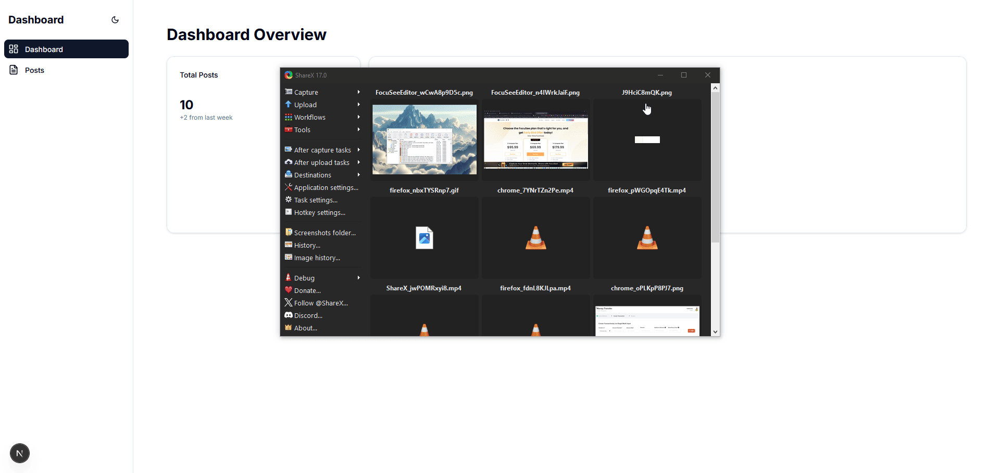

# Technical Documentation

You can see the tech doc in here: [Technical Doc](docs/technical-documentation.md)


## Getting Started

First, run the development server:

```bash
npm run dev
# or
yarn dev
# or
pnpm dev
# or
bun dev
```

## Run test
You can run the test: 

```bash
npm run test
# or
yarn test
# or
pnpm test
# or
bun test
```


## Screenshot
