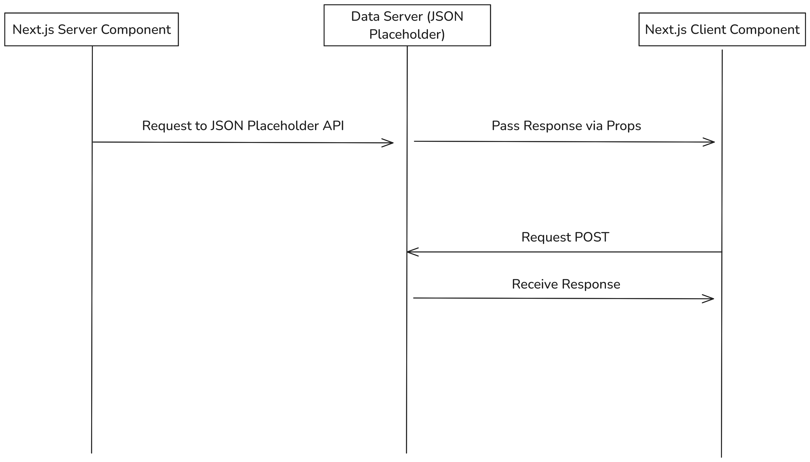
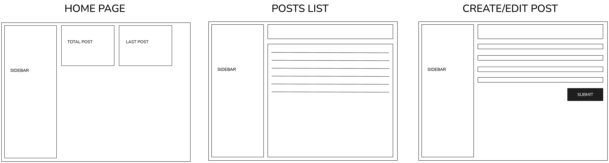

# Table of Contents

- [Table of Contents](#table-of-contents)
  - [Technical Documentation](#technical-documentation)
    - [High-level Design](#high-level-design)
    - [Wireframe Design](#wireframe-design)
    - [API Design Contract (JSONPlaceholder)](#api-design-contract-jsonplaceholder)


## Technical Documentation


### High-level Design




###  Wireframe Design




### API Design Contract (JSONPlaceholder)


| Endpoint       | Method | Description                         | Parameters / Request Body Details                                                                                         | Response Example                       |
| -------------- | ------ | ----------------------------------- | ------------------------------------------------------------------------------------------------------------------------- | -------------------------------------- |
| **/posts**     | GET    | Retrieve a list of posts            | **Query Parameters:** <br> - `userId` (optional): Filter posts by the user ID                                             | Array of post objects                  |
| **/posts/:id** | GET    | Retrieve a single post by its ID    | **Path Parameter:** <br> - `id` (number): ID of the post                                                                  | Single post object                     |
| **/posts**     | POST   | Create a new post                   | **JSON Body:** <br> ```json<br>{<br>  "userId": number,<br>  "title": string,<br>  "body": string<br>}<br>                | Newly created post object              |
| **/posts/:id** | PUT    | Replace an existing post completely | **Path Parameter:** `id` <br> **JSON Body:** Full object (all fields must be specified – `id`, `userId`, `title`, `body`) | Updated post object                    |
| **/posts/:id** | PATCH  | Update parts of a post              | **Path Parameter:** `id` <br> **JSON Body:** Partial object containing only the fields to update                          | Updated post object                    |
| **/posts/:id** | DELETE | Delete a post                       | **Path Parameter:** `id`                                                                                                  | Empty object (or confirmation message) |

---


<!-- Endpoint	Method	Description	Parameters / Request Body Details	Response Example
/posts	GET	Retrieve a list of posts	Query Parameters:
- userId (optional): Filter posts by the user ID	Array of post objects
/posts/:id	GET	Retrieve a single post by its ID	Path Parameter:
- id (number): ID of the post	Single post object
/posts	POST	Create a new post	JSON Body:
```json
{
"userId": number,
"title": string,
"body": string
}
	Newly created post object
/posts/:id	PUT	Replace an existing post completely	Path Parameter: id
JSON Body: Full object (all fields must be specified – id, userId, title, body)	Updated post object
/posts/:id	PATCH	Update parts of a post	Path Parameter: id
JSON Body: Partial object containing only the fields to update	Updated post object
/posts/:id	DELETE	Delete a post	Path Parameter: id	Empty object (or confirmation message) -->
